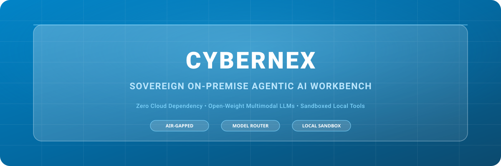
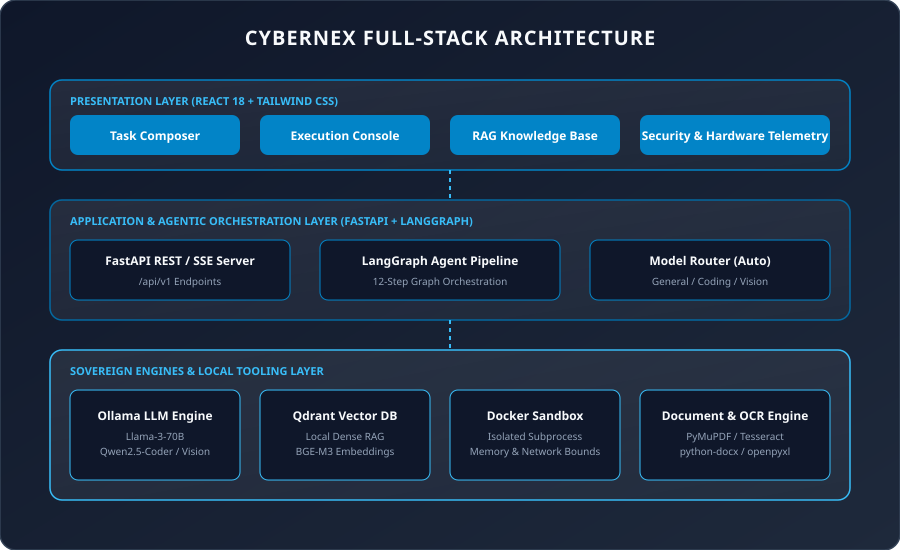
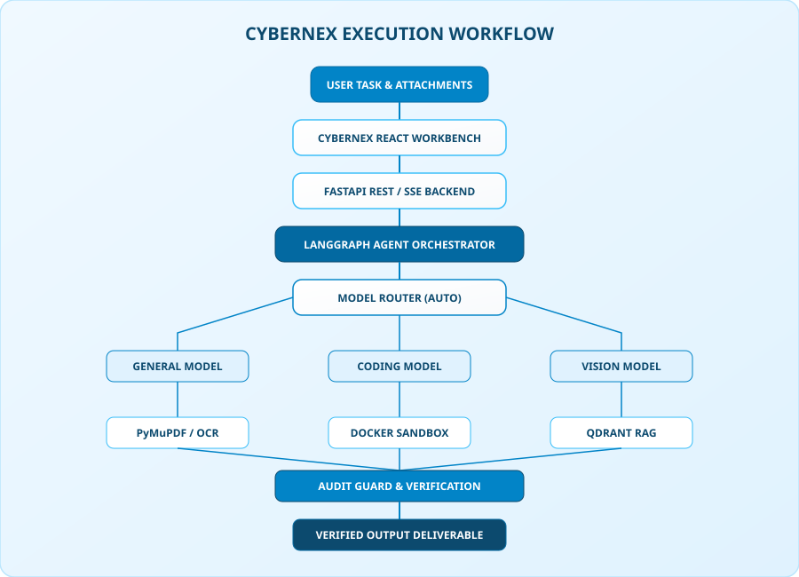

# CYBERNEX — Sovereign On-Premise Agentic AI Workbench

CYBERNEX is a sovereign, local-first AI workbench designed for confidential industrial work. Powered by open-weight multimodal LLMs, local vector databases, PyMuPDF/Tesseract OCR, sandboxed Python code execution, and formal document generation, CYBERNEX delivers enterprise agentic automation with zero data leakage guarantees.

---

## 1. Project Overview

CYBERNEX provides enterprise operations, industrial engineering teams, and security-sensitive organizations with a complete local-first AI workbench. Unlike public cloud AI wrappers, CYBERNEX executes all reasoning, model routing, optical character recognition, vector retrieval, and code execution locally on host hardware.

- ** sovereign Local Architecture**: 100% on-premise execution with zero cloud telemetry.
- **Multimodal Task Composer**: Single glass surface workbench supporting text, confidential documents, technical diagrams, and engineering code.
- **Intelligent Model Router**: Automatic intent-based routing across General, Coding, and Vision models.
- **Sandboxed Execution**: Isolated Docker container / subprocess sandbox with CPU, RAM, and network bounds.

---

## 2. Why CYBERNEX?

Standard enterprise AI applications rely on third-party cloud APIs, exposing confidential SOPs, turbine inspection telemetry, and proprietary source code to external risks. CYBERNEX eliminates cloud exposure by running open-weight models (Llama-3-70B, Qwen2.5-Coder-32B, Llama-3.2-Vision) locally via Ollama and Qdrant.

---

## 3. Core Capabilities

- ** Multimodal Document Inspection**: Parse scanned PDF inspection reports, cross-reference against SOP manuals using RAG, and generate formal `.docx` executive sign-off notes.
- ** Sandboxed Code Synthesis**: Generate, inspect, and execute Python analysis scripts inside an isolated containerized environment.
- ** Visual Engineering Analysis**: Ingest and describe engineering P&ID diagrams, pressure telemetry plots, and structural schematics using local Vision models.
- ** Zero-Cloud Security Telemetry**: Real-time auditing confirming 0 external outbound connections and active local air-gap isolation.

---

## 4. Architecture



The CYBERNEX full-stack system comprises three decoupled layers:
1. **React 18 Frontend**: Premium light sky-blue glass UI with workspace navbar, task composer, SSE execution timeline console, and telemetry dashboards.
2. **FastAPI Backend (`/backend`)**: High-performance REST/SSE API router, LangGraph agent orchestrator, Pydantic v2 schemas, and SQLAlchemy SQLite database.
3. **Sovereign Local Services**: Ollama LLM provider, Qdrant vector database, PyMuPDF/Tesseract OCR, and Docker Python sandbox executor.

---

## 5. Execution Workflow



```
USER TASK & ATTACHMENTS
         │
         ▼
CYBERNEX REACT WORKBENCH
         │
         ▼
FASTAPI REST / SSE BACKEND
         │
         ▼
LANGGRAPH AGENT ORCHESTRATOR
         │
         ▼
MODEL ROUTER (AUTO)
 ┌───────┼───────┐
 ▼       ▼       ▼
GENERAL CODING  VISION
 └───────┼───────┘
         ▼
    LOCAL TOOLS
 ┌───────┼───────┐
 ▼       ▼       ▼
OCR     RAG   SANDBOX
 └───────┼───────┘
         ▼
AUDIT GUARD & VERIFICATION
         │
         ▼
VERIFIED OUTPUT DELIVERABLE
```

---

## 6. Technology Stack

- **Frontend**: React 18, TypeScript, Vite, Tailwind CSS, Lucide Icons, React Router v6.
- **Backend**: Python 3.11+, FastAPI, Uvicorn, Pydantic v2, SQLAlchemy, PyJWT, bcrypt.
- **Local AI & RAG**: Ollama HTTP API, Qdrant Vector DB, BGE-M3 Embeddings.
- **Document & Sandbox**: PyMuPDF, python-docx, Pillow, pytesseract, Docker SDK, psutil.
- **Testing**: Pytest, FastAPI TestClient.

---

## 7. Project Structure

```
CYBERNEX/
├── frontend/                     # React 18 SPA Workspace Frontend
│   ├── src/
│   │   ├── components/           # UI, Glass, Workbench & Navigation components
│   │   ├── context/              # AppContext state management
│   │   ├── lib/                  # Centralized API client bridge (api.ts)
│   │   ├── pages/                # Workbench, Runs, Knowledge, Models, Security, System
│   │   ├── routes/               # AppRoutes configuration
│   │   └── types/                # TypeScript interface definitions
│   ├── package.json
│   └── vite.config.ts
├── backend/                      # FastAPI Modular Sovereign Backend
│   ├── app/
│   │   ├── api/v1/               # Health, Auth, Workbench, Tasks, Files, Models, RAG, Runs
│   │   ├── core/                 # Config, Security, Logging
│   │   ├── db/                   # Database engine & SQLAlchemy ORM models
│   │   ├── schemas/              # Pydantic v2 validation models
│   │   ├── services/             # Agent orchestrator, Model router, OCR, RAG, Sandbox, DocGen
│   │   └── main.py               # FastAPI application entry point
│   ├── storage/                  # Local uploads, documents, outputs, and logs
│   ├── tests/                    # Pytest test suite
│   ├── requirements.txt
│   └── .env.example
├── docs/assets/                  # Standalone SVG Architecture & Workflow diagrams
│   ├── cybernex-banner.svg
│   ├── cybernex-workflow.svg
│   └── cybernex-architecture.svg
└── README.md
```

---

## 8. Requirements

- **Node.js**: 18.0+ & `npm`
- **Python**: 3.11+ & `pip`
- **Ollama**: Recommended for local model serving (`llama3:70b`, `qwen2.5-coder:32b`, `llama3.2-vision`)
- **Qdrant**: Recommended for dense vector retrieval (Port 6333)
- **Docker**: Recommended for containerized Python sandbox isolation

---

## 9. Installation

### Clone Repository & Navigate
```bash
cd d:\PROJECTS\CYBERNEX
```

### Install Backend Dependencies
```bash
cd backend
python -m venv venv
# On Windows PowerShell:
.\venv\Scripts\Activate.ps1
# On Linux/macOS:
source venv/bin/activate

pip install -r requirements.txt
```

### Install Frontend Dependencies
```bash
cd ../frontend
npm install
```

---

## 10. Environment Configuration

### Backend Environment (`backend/.env`)
```bash
cp backend/.env.example backend/.env
```

```env
APP_NAME=CYBERNEX
ENVIRONMENT=development
DEMO_MODE=false

HOST=127.0.0.1
PORT=8000

FRONTEND_URL=http://localhost:5173
CORS_ORIGINS=["http://localhost:5173","http://127.0.0.1:5173"]

DATABASE_URL=sqlite:///./storage/cybernex.db
QDRANT_URL=http://localhost:6333
OLLAMA_URL=http://localhost:11434

GENERAL_MODEL=llama3:70b
CODING_MODEL=qwen2.5-coder:32b
VISION_MODEL=llama3.2-vision

JWT_SECRET=cybernex_sovereign_secret_key_change_in_production_32bytes
```

---

## 11. Starting Local Services

### 1. Launch FastAPI Backend
```bash
cd backend
uvicorn app.main:app --reload --port 8000
```
- API Base URL: `http://127.0.0.1:8000/api/v1`
- OpenAPI Docs: `http://127.0.0.1:8000/docs`

### 2. Launch React Frontend
```bash
cd frontend
npm run dev
```
- Application Web URL: `http://localhost:5173`

---

## 12. Local Infrastructure Setup (Optional Services)

### Ollama Setup
```bash
ollama serve
ollama pull llama3:70b
ollama pull qwen2.5-coder:32b
ollama pull llama3.2-vision
```

### Qdrant Vector Database Setup
```bash
docker run -p 6333:6333 -p 6334:6334 qdrant/qdrant
```

---

## 13. API Documentation

The FastAPI backend automatically generates interactive documentation:
- **Swagger UI**: `http://127.0.0.1:8000/docs`
- **ReDoc**: `http://127.0.0.1:8000/redoc`

### Primary API Endpoints
- `GET /api/v1/health`: Sovereign API & service health verification.
- `POST /api/v1/tasks`: Submit user prompt, tools, and attachments for agent execution.
- `POST /api/v1/files/upload`: Secure file upload returning metadata & file ID.
- `GET /api/v1/models`: Returns local AI models inventory and live connectivity.
- `POST /api/v1/knowledge/search`: Vector database semantic search across SOP collections.
- `GET /api/v1/runs/{id}/events`: Server-Sent Events (SSE) stream for step timeline.
- `POST /api/v1/sandbox/run`: Sandboxed Python script execution.

---

## 14. Supported File Types

- **Documents**: PDF (`.pdf`), Word (`.docx`), Plain Text (`.txt`)
- **Data & Telemetry**: Excel (`.xlsx`), CSV (`.csv`), JSON (`.json`)
- **Engineering Visuals**: PNG (`.png`), JPEG (`.jpg`, `.jpeg`), WebP (`.webp`)
- **Executable Code**: Python (`.py`), JavaScript (`.js`), TypeScript (`.ts`)

---

## 15. Security Model & Air-Gap Guarantees

- **No Cloud Fallback**: Zero external API keys or cloud model calls allowed by default.
- **Filesystem Isolation**: File uploads stored under strict permissions in `storage/uploads/`.
- **JWT & Password Security**: Bcrypt password hashing and signed HS256 tokens.
- **Sandboxed Execution**: Isolated Docker runtime preventing host system calls or network egress.

---

## 16. Development Mode (`DEMO_MODE`)

- **Default Mode (`DEMO_MODE=false`)**: Strict production execution. If Ollama or Qdrant are offline, the application authentically reports `UNAVAILABLE` without inserting fake metrics or dummy records.
- **UI Demo Mode (`DEMO_MODE=true`)**: Displays a clear `DEMO MODE` badge in the workspace navbar when mock data is enabled strictly for visual interface testing.

---

## 17. Testing Suite

### Run Backend Pytest Suite
```bash
cd backend
pytest tests/test_backend.py
```

### Run Frontend Production Build
```bash
cd frontend
npm run build
```

---

## 18. Troubleshooting

| Issue | Cause | Solution |
| :--- | :--- | :--- |
| `Ollama Unavailable` | Ollama daemon not running on port 11434 | Run `ollama serve` or check `OLLAMA_URL` in `.env` |
| `Qdrant Standalone` | Qdrant container not running | Run `docker run -p 6333:6333 qdrant/qdrant` |
| `CORS Error` | Origin mismatch on port 5173 | Ensure `FRONTEND_URL` in `.env` matches Vite URL |
| `Tesseract Warning` | Tesseract binary not installed | OCR will fallback to PyMuPDF text extraction |

---

## 19. Project Status & License

- **Status**: Production-Ready Sovereign AI Workbench v1.0.0
- **License**: MIT License
- **Author**: CYBERNEX Sovereign Development Group
